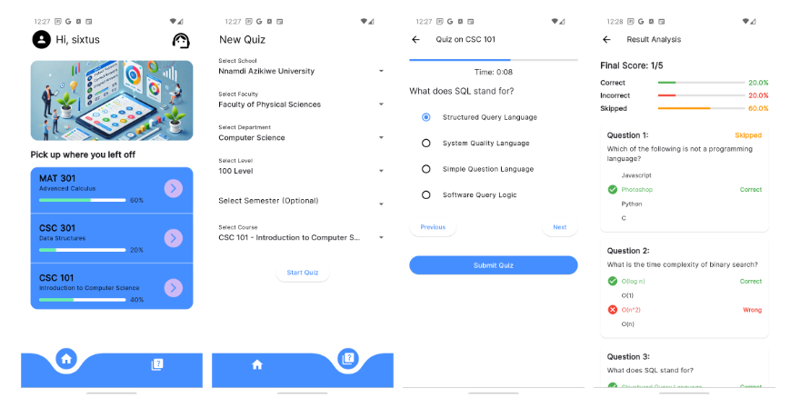

# Ace iT

Past-questions based exam preparation app. Still a Work in Progress.

Visit the [website](https://aceitpro.com/).



## Table of contents

- [Inspiration](#inspiration)
- [Getting Started](#getting-started)
  - [Requirements](#requirements)
  - [Installation](#installation)
- [Technologies](#technologies)
- [Future](#future)
- [Contributing](#contributing)
- [Acknowledgements](#acknowledgements)
- [Author](#author)

# Inspiration
Most exam questions tend to follow a similar structure to past questions, and some teachers even repeat questions. However, after exams, students often discard their question papers, only to scramble for them when exams approach again.

I recall a moment during my 200-level studies when I overheard a group of students discussing how the structure of their current exam questions matched past questions. They mentioned the usefulness of apps for past JAMB or WAEC questions and wished for a mobile app that could provide easy access to past questions across various subjects.

Realizing this need, I saw an opportunity to create a solution. When the time came to choose a project for my ALX specializations phase, I decided to build a product that would make accessing past questions easier for students. This app aims to help students prepare effectively, ensuring they have the resources they need to succeed.
<!-- Link to blog post -->

## Getting Started

Follow these instructions to set up and run the **Ace iT** app on your local machine for development and testing purposes.

- ### Requirements

  Ensure you have the following installed:

  - [Flutter SDK](https://docs.flutter.dev/get-started/install)
  - [Dart](https://dart.dev/get-dart) (included with Flutter)
  - An IDE like [VSCode](https://code.visualstudio.com/) or [Android Studio](https://developer.android.com/studio)
  - After setting up a new project on [Firebase console](https://console.firebase.google.com/), download and add valid **Google Services** configuration file for Firebase integration:
    - **Android**: `google-services.json`
    - **iOS**: `GoogleService-Info.plist`

- ### Installation

  * **Clone the repository:**

    ```bash
    git clone https://github.com/sixtusagbo/aceit
    cd aceit
    ```
  
  * Install Flutter dependencies:

    ```bash
    flutter pub get
    ```

  * Set up the environment variables:

    - Copy over the [.env.example file](lib/.env.example) to a new file called development.env (or your preferred name).
    - Update the env variables with the appropriate values from Firebase console.
  
  * Run the code generator:

    To build:
    ```bash
    dart run build_runner build -d
    ```
    Run in watch mode if you'll be making more changes:
    ```bash
    dart run build_runner watch -d
    ```
  
  * Run the app

    Make sure you have an emulator running or a physical device connected, then:
    - On CLI: `flutter run`
    - On VSCode: `Ctrl + F5`
    - On Android Studio: ``

## Technologies

* Dart (Language)
* Flutter (Framework)
* Firebase (BaaS)

## Future

There are many features I want to add, this is an MVP for now. Features like:

- [ ] Notifications
- [ ] AI integration

## Contributing

You can open an [issue](https://github.com/sixtusagbo/aceit/issues) or if you wish to add a feature:

- [Fork the repo](https://github.com/sixtusagbo/aceit/fork)
- Create a branch for your new feature ( `git checkout -b my-new-feature` )
- Follow the [getting started instructions](#getting-started)
- Write the code for your feature
- Commit your changes (`git commit -am 'Added some feature'`)
- Push to a new feature branch (`git push origin my-new-feature`)
- Create a new [Pull Request](https://github.com/sixtusagbo/aceit/pulls)

## Acknowledgements

In a very special way, my acknowledgement goes to the ALX team, to Julien for his never ending stream of encouraging words.

Also, I’d like to specially recognize my colleagues in Listacc here and also my bosses Sir Vincent and Sir Agozie, they’ve given me immense support through this period.

## Author

Built with 💖 by Sixtus Miracle Agbo

[Twitter](https://twitter.com/sixtusagbo) | [LinkedIn](https://linkedin.com/in/sixtusagbo) | [Youtube](https://youtube.com/@sixtusagbo) | [Email](mailto:miracleagbosixtus@gmail.com)
